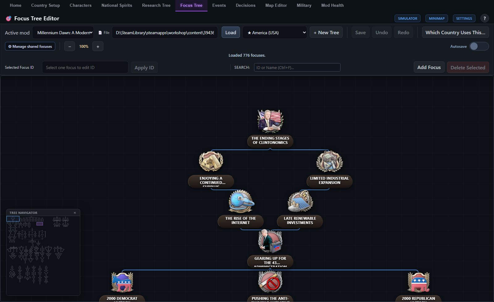
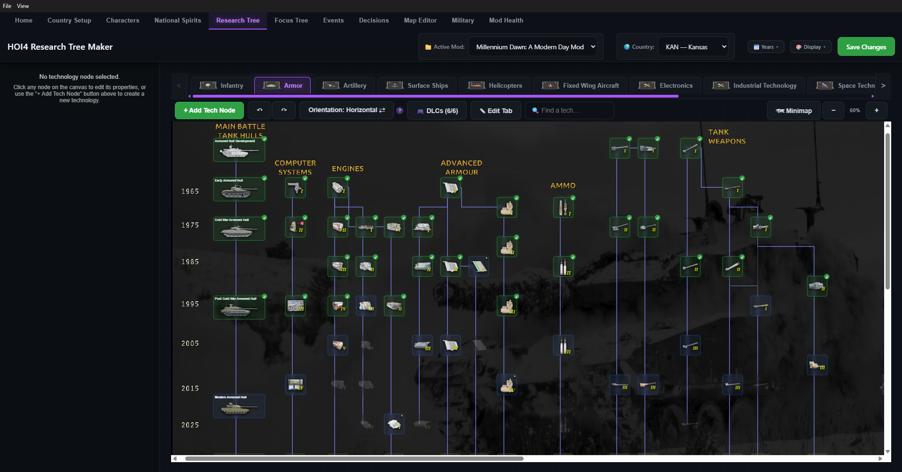
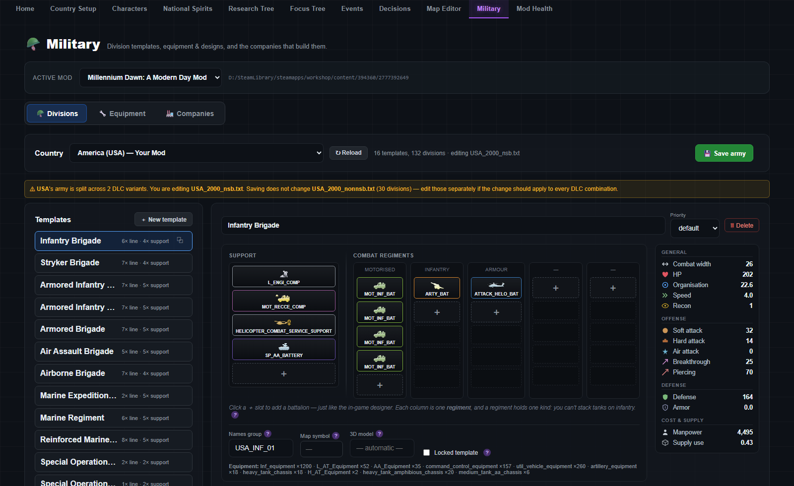
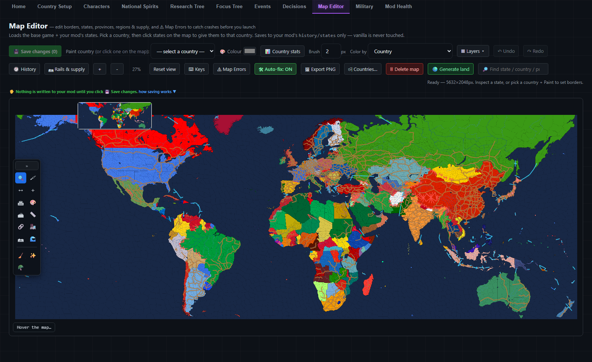

# Nova Modding Suite

### 💬 [Join the Discord](https://discord.gg/Z6P23hjEsM) — **please report any bugs you find there.**

**A visual editor for Hearts of Iron IV mods.** Focus trees, research, events, decisions, national spirits, characters, country setups, a full military maker and a map editor — without hand-writing Paradox script.

Nova reads the game the way HOI4 does (base game → dependencies → your mod) and writes **only to your own mod**. Vanilla and the mods you depend on are opened read-only.

> Not affiliated with or endorsed by Paradox Interactive. Hearts of Iron IV is a trademark of Paradox Interactive.

---

*Focus tree editor — Millennium Dawn's USA tree, 776 focuses, with the tree navigator open.*

*Research tree — drawn from your mod's own `.gui` geometry, sprites and fonts, so it matches what the game will show.*

*Military — the division designer on the game's own regiment grid, with live stats.*

*Map editor — states, provinces, supply, rails and borders. Nothing is written until you press Save.*

---

## What's inside

| Tool | What it does |
|------|--------------|
| **Country Setup** | Create a country or edit an existing one — ideology, ruling party, popularities, spirits, capital (picked on the map), starting tech and equipment. |
| **Focus Tree** | Drag-and-drop designer with a deep effect/trigger engine, shared and continuous focuses, a simulator, and a plain-English preview of what each focus does. |
| **Research Tree** | Custom tabs, techs and equipment, drawn with your mod's real tree geometry. Year rails, section labels, folder backgrounds, undo/redo, and a minimap. |
| **Events** | Options, triggers, MTTH and typed fire dates, `after`, timeouts — previewed in the game's real event windows (newspaper, report, military leader, operative). |
| **Decisions** | Categories and missions with costs, timers, cooldowns, targets and the full advanced field set. |
| **National Spirits** | Country ideas with modifiers, equipment bonuses, research bonuses and AI hints. |
| **Characters** | Country leaders, advisors, generals and admirals — traits, portraits, and a visual portrait browser. |
| **Military** | Division templates on the game's own designer grid; the arsenal of every country's equipment; modular variants; custom modules and upgrades; manufacturers (MIOs) and designer companies; starting stockpiles, fleets and air forces; and orders of battle you can place on the map. |
| **Map Editor** | State ownership, cores, manpower, buildings, resources, victory points, province moves, strategic regions, supply areas, terrain, rails and province painting. |
| **Mod Health** | Validation with a score, grouped issues, deep links into the right maker, and some auto-fixes. |

**Genesis** turns scripted content into plain English throughout, so you can read a focus, spirit or decision back as a sentence instead of a wall of tokens.

## About saving

Nova writes to your mod folder, so it is worth being clear about what it does and does not do.

- Every write goes through one path that **takes a `.bak` first**, writes to a temp file, then swaps it in — so an interrupted save cannot leave a half-written file. It retries if antivirus is holding the file open.
- Before saving the map it **checks for the documented launch-crash causes** — a province in two states, a state or supply area split across strategic regions, factories over the building slots, a country annexed out of its capital, a sea province inside a state, a missing state category — and refuses or warns rather than writing them.
- It will not touch vanilla or the mods you depend on. Only your active mod.

None of that is a guarantee. **Keep your own backups of anything you care about** — the app says the same thing on first run. If something does go wrong, the in-app diagnostics bundle the game's logs and the newest crash dump into one report.

---

## Download

Grab the latest `.exe` from the [Releases](../../releases) page and run it. It is portable — no installer.

Nova checks the releases page on startup and tells you when a newer version is out.

> The build isn't code-signed, so Windows SmartScreen will likely show *"Windows protected your PC."* Choose **More info → Run anyway**.

**Requirements:** Windows (x64) and Hearts of Iron IV installed — Nova reads the game's assets and localisation from your existing copy. It finds the game and your mods under the usual Steam and Documents paths.

---

## Bugs and feedback

**Report bugs on the [Discord](https://discord.gg/Z6P23hjEsM)** — that's where they get seen and answered fastest.

Whatever you report, these three things help more than anything else: **which mod you were editing**, **what you were doing when it went wrong**, and the **diagnostics report** if the app produced one.

## Licence

**CC BY-NC-ND 4.0** — Attribution, NonCommercial, NoDerivatives. See [LICENSE](LICENSE).

In plain words: **share it freely, don't sell it, don't publish a modified version.** Anything *you* build with Nova is yours — the licence covers Nova itself, not your mods. If you want to do something it doesn't allow, open an issue and ask; the answer may well be yes.

Hearts of Iron IV, its game files and trademarks are © Paradox Interactive and are not redistributed here. Nova reads the copy already installed on your machine.
